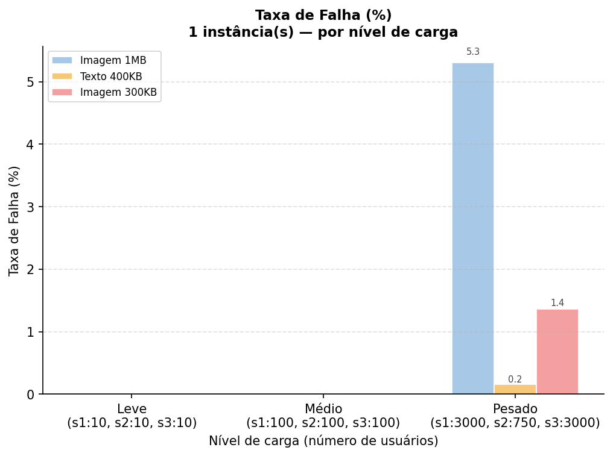
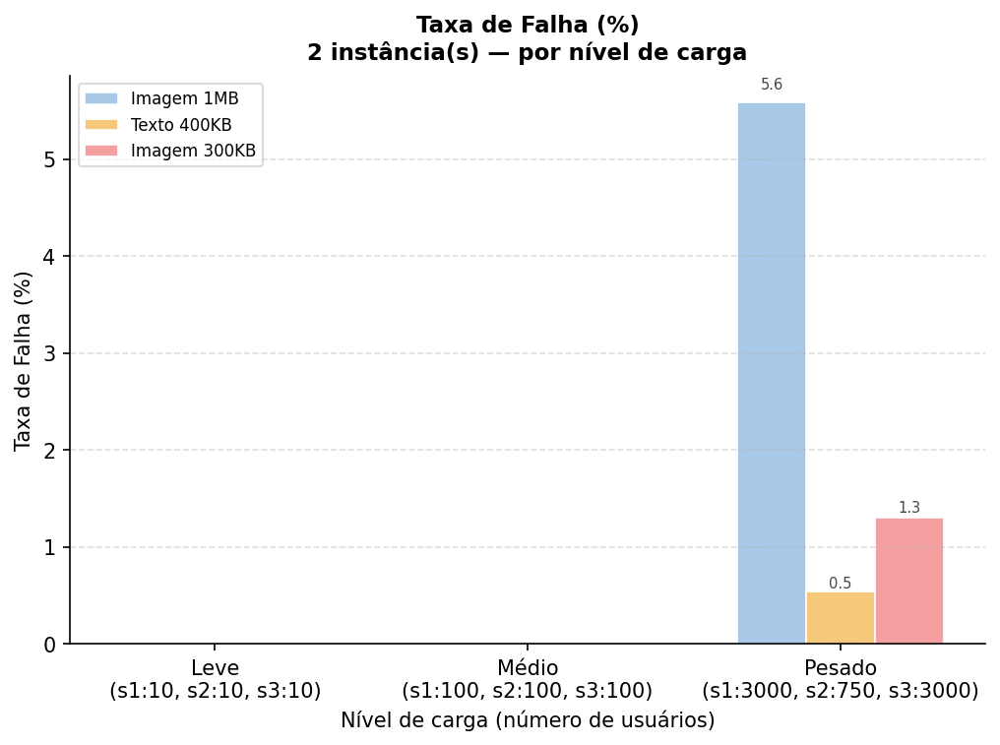
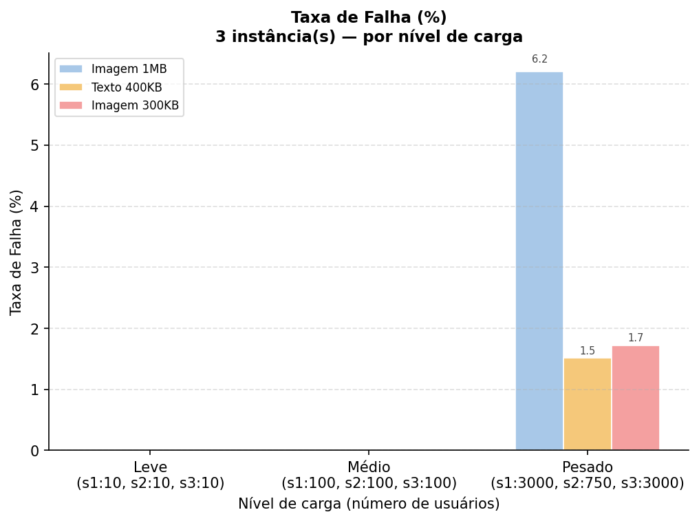
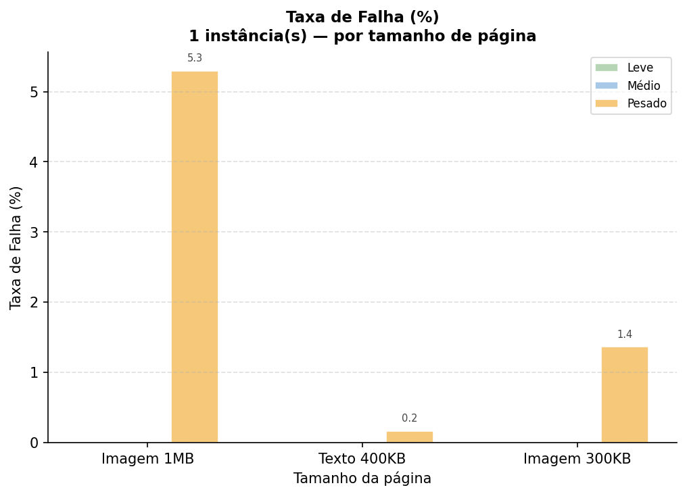
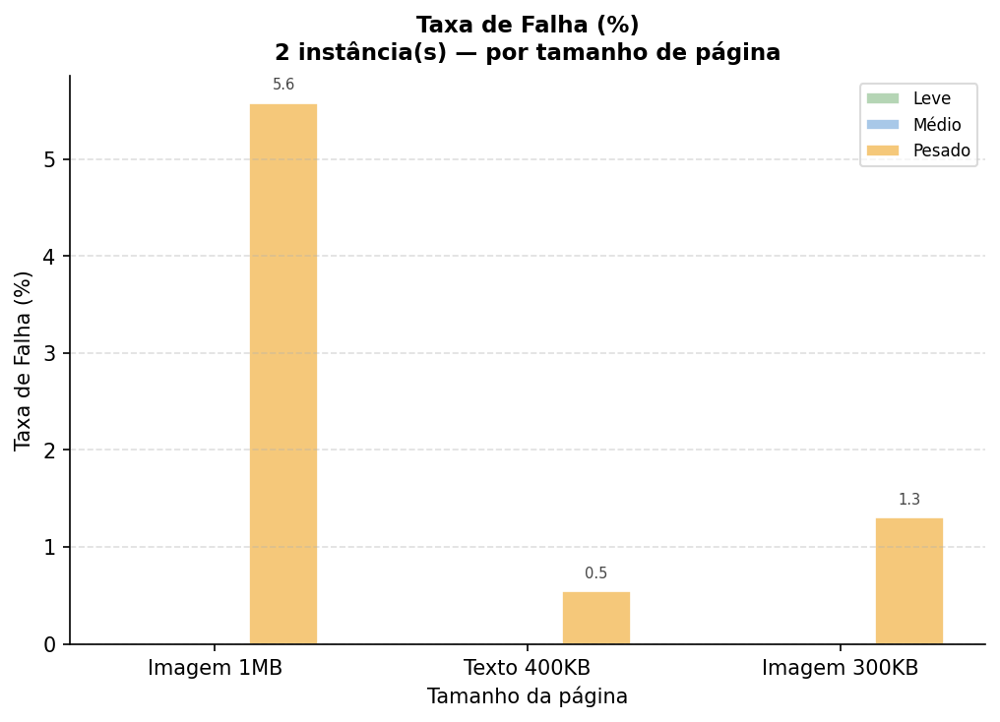
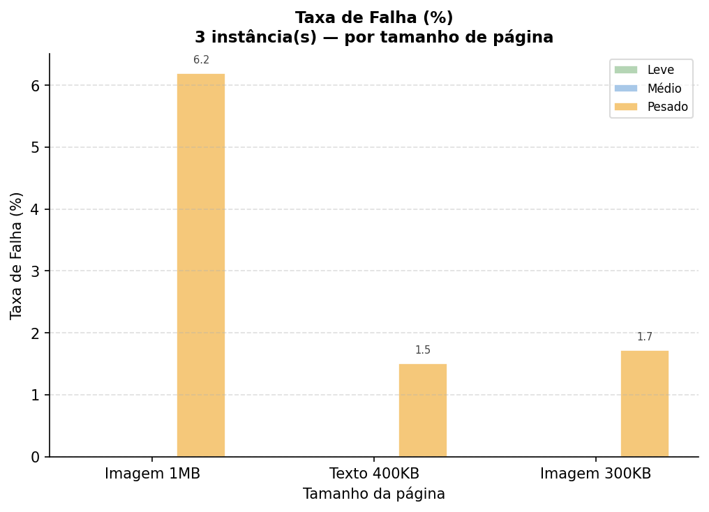
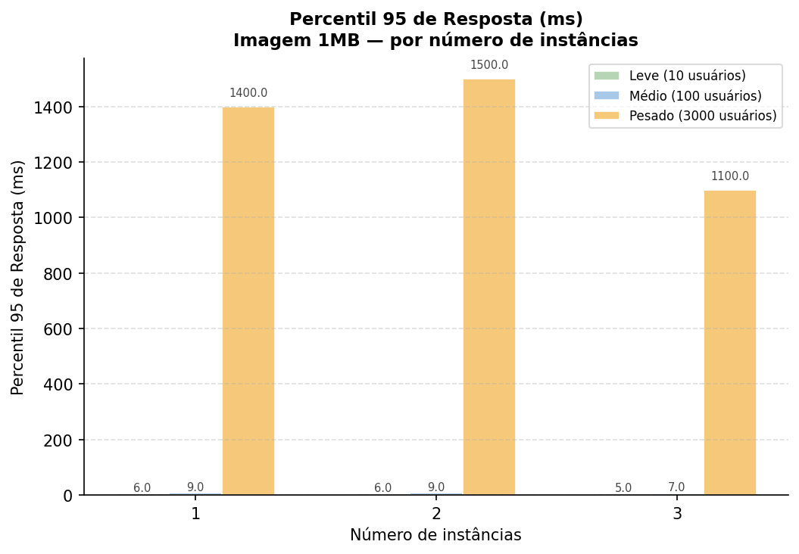
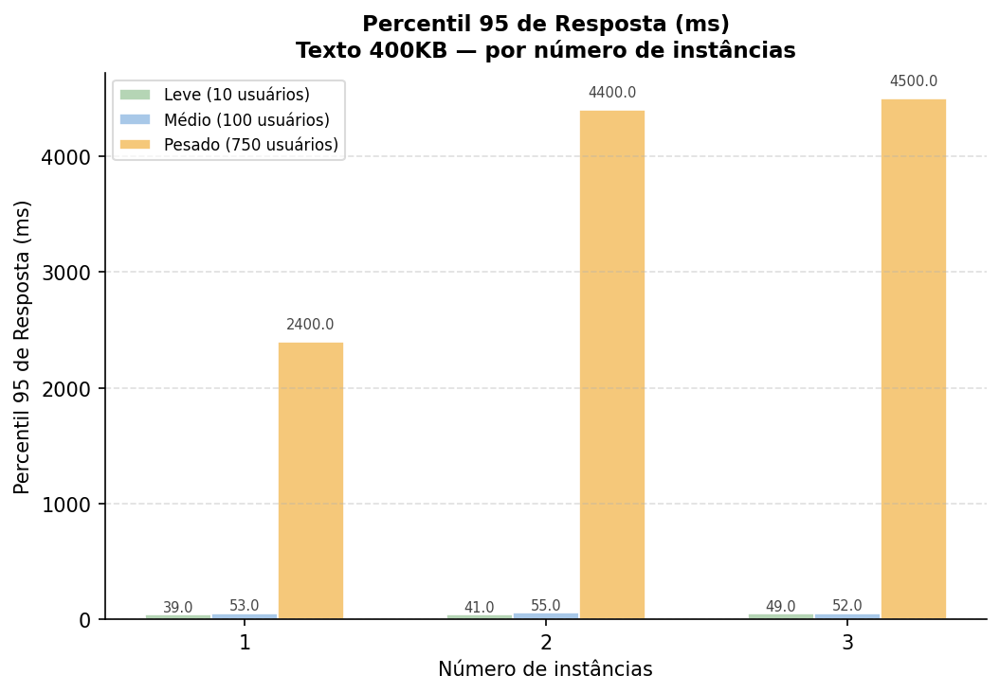
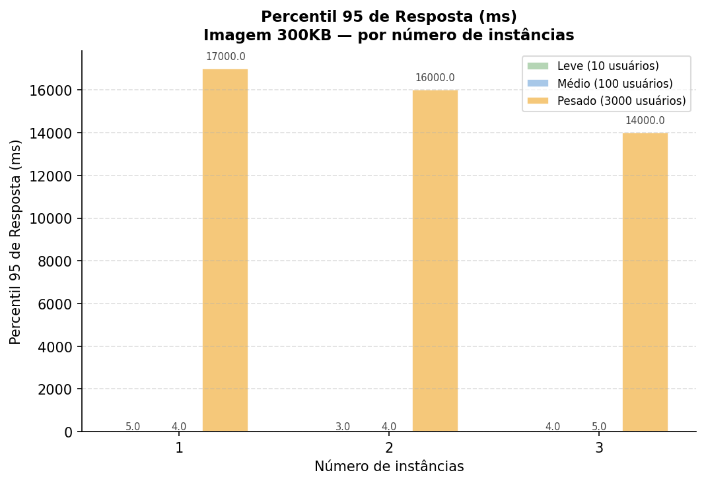

# Trabalho 3 — Testes de Carga com Locust

Nome: Cainã Rocha  
Matrícula: 2315038  

Nome: Davi Silveira  
Matrícula: 2310347 

Nome: Marcos André  
Matrícula: 2310371 

Nome: Pedro Vieira  
Matrícula: 2315708 

Universidade de Fortaleza — UNIFOR

## Descrição

Este trabalho realiza testes de carga em múltiplas instâncias do WordPress usando o Locust, variando o número de usuários simultâneos e o número de instâncias da aplicação. A infraestrutura é composta por um banco MySQL, instâncias WordPress escaláveis e um Nginx como balanceador de carga, todos orquestrados via Docker Compose.

---

## Arquitetura

```
[Locust] → [Nginx (porta 80)] → [WordPress x N instâncias] → [MySQL]
```

- **Nginx**: balanceador de carga com round-robin
- **WordPress**: escalado com `--scale wordpress=N`
- **MySQL**: banco de dados compartilhado entre as instâncias
- **Locust**: gerador de carga em modo headless

---

## Cenários de Teste

| Cenário | Descrição | Usuários testados |
|---|---|---|
| scenario1 | Blog post com imagem ~1 MB | 10, 100, 3000 |
| scenario2 | Blog post com texto ~400 KB | 10, 100, 750 |
| scenario3 | Blog post com imagem ~300 KB | 10, 100, 3000 |
| hybrid | Todos os posts simultaneamente | 10, 100, 800 |

Cada cenário foi executado com 1, 2 e 3 instâncias do WordPress, totalizando **36 testes** e **36 arquivos CSV**.

---

## Resultados e Análise

### Cenário 1 — Imagem ~1 MB

| Usuários | Instâncias | p95 (ms) | Taxa de Falha |
|---|---|---|---|
| 10 | 1 | 6 | 0% |
| 10 | 2 | 6 | 0% |
| 10 | 3 | 5 | 0% |
| 100 | 1 | 9 | 0% |
| 100 | 2 | 9 | 0% |
| 100 | 3 | 7 | 0% |
| 3000 | 1 | 1400 | 5,30% |
| 3000 | 2 | 1500 | 5,57% |
| 3000 | 3 | 1100 | 6,20% |

Com cargas leve e média, o sistema respondeu com excelente latência (p95 < 10ms). Sob carga pesada (3000 usuários), o tempo de resposta subiu para a casa de 1s, e a taxa de falha estabilizou em torno de 5-6%. Embora 3 instâncias tenham oferecido o melhor p95 (1100ms), elas registraram a maior taxa de falha (6,20%), sugerindo que o gargalo de concorrência no volume compartilhado de arquivos grandes começa a impactar a estabilidade das conexões.

---

### Cenário 2 — Texto ~400 KB

| Usuários | Instâncias | p95 (ms) | Taxa de Falha |
|---|---|---|---|
| 10 | 1 | 39 | 0% |
| 10 | 2 | 41 | 0% |
| 10 | 3 | 49 | 0% |
| 100 | 1 | 53 | 0% |
| 100 | 2 | 55 | 0% |
| 100 | 3 | 52 | 0% |
| 750 | 1 | 2400 | 0,16% |
| 750 | 2 | 4400 | 0,54% |
| 750 | 3 | 4500 | 1,52% |

Este cenário mostrou-se o mais sensível à orquestração de múltiplas instâncias. Ao subir para 3 instâncias sob carga pesada, o p95 saltou de 2400ms para 4500ms e a taxa de falha aumentou quase 10 vezes (de 0,16% para 1,52%). Isso indica que, para transferência de texto puro, o custo de processamento do balanceamento de carga do Nginx e a gerência de rede entre containers superam o benefício da distribuição de carga.

---

### Cenário 3 — Imagem ~300 KB

| Usuários | Instâncias | p95 (ms) | Taxa de Falha |
|---|---|---|---|
| 10 | 1 | 5 | 0% |
| 10 | 2 | 3 | 0% |
| 10 | 3 | 4 | 0% |
| 100 | 1 | 4 | 0% |
| 100 | 2 | 4 | 0% |
| 100 | 3 | 5 | 0% |
| 3000 | 1 | 17000 | 1,36% |
| 3000 | 2 | 16000 | 1,30% |
| 3000 | 3 | 14000 | 1,72% |

O cenário 3 apresentou o melhor p95 em carga baixa, mas sofreu a maior degradação de tempo de resposta sob estresse (chegando a 17 segundos). No entanto, a taxa de falha permaneceu muito baixa (abaixo de 2%), o que mostra que o servidor consegue processar as requisições, mas a fila de espera torna-se impraticável para o usuário final. Aqui, o uso de 3 instâncias ajudou a reduzir o p95 em 3 segundos comparado a uma única instância.

---

### Cenário Híbrido — Todos os posts

| Usuários | Instâncias | p95 (ms) | Taxa de Falha |
|---|---|---|---|
| 10 | 1 | 39 | 0% |
| 10 | 2 | 32 | 0% |
| 10 | 3 | 32 | 0% |
| 100 | 1 | 33 | 0% |
| 100 | 2 | 33 | 0% |
| 100 | 3 | 37 | 0% |
| 800 | 1 | 2200 | 0,05% |
| 800 | 2 | 2200 | 0,03% |
| 800 | 3 | 2100 | 0,05% |

O cenário híbrido foi o vencedor absoluto em termos de estabilidade. Com a carga distribuída entre diferentes tipos de recursos, a taxa de falha foi virtualmente nula (máximo de 0,05%). O sistema se comportou de forma linear, onde o número de instâncias teve pouco impacto negativo, provando que a diversidade de requisições ajuda a evitar gargalos em um único componente da infraestrutura.

---

## Conclusões

- **Escalabilidade não é linear**: em cenários de texto (400KB), o overhead do Docker/Nginx pode tornar o sistema mais lento ao adicionar instâncias.
- **Resiliência Híbrida**: a distribuição de carga entre múltiplos endpoints (posts diferentes) é a estratégia mais eficaz para manter a taxa de falha próxima de zero.
- **Gargalo de Tempo vs. Falha**: no cenário 3 (300KB), o sistema priorizou "entregar a resposta mesmo que demore" (baixa falha, altíssimo p95), enquanto no cenário 1 (1MB), ele priorizou "cortar a conexão para não travar" (maior taxa de falha, p95 menor).
- **Eficiência de 2 instâncias**: Para a maioria dos testes de carga pesada, a configuração com 2 instâncias apresentou o equilíbrio ideal entre taxa de falha e tempo de resposta.

---

## Como Reproduzir

```bash
# 1. Subir a infraestrutura
docker compose up -d
sleep 30

# 2. Rodar os testes
bash -x ./run_tests.sh

# 3. Gerar os gráficos
pip install pandas matplotlib
python plot_results.py
```

Os CSVs ficam em `volumes/locust/results/` e os gráficos em `volumes/locust/graficos/`.

## Gráficos
### Gráficos Taxa de Falha x Nível de Carga




---

### Gráficos Taxa de Falha x Tamanho da página




---

### Gráficos Percentil 95 x Nº de instâncias



